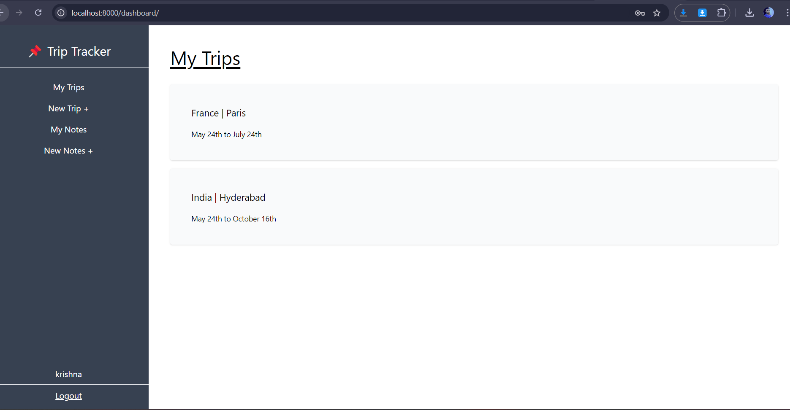
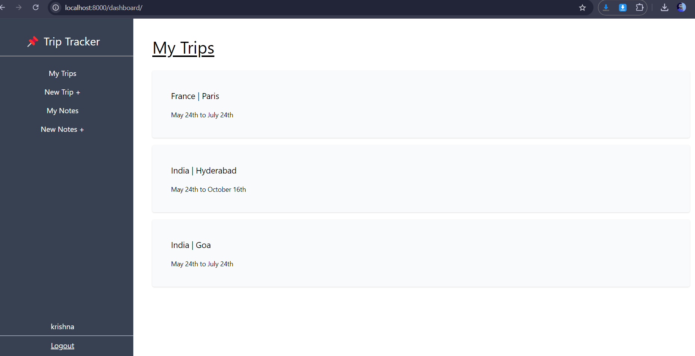
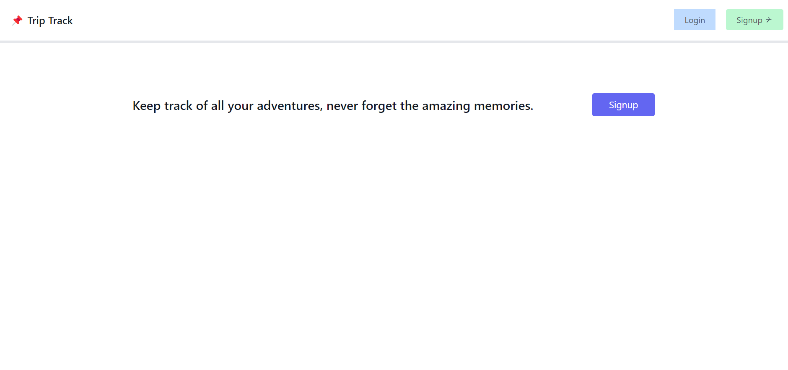
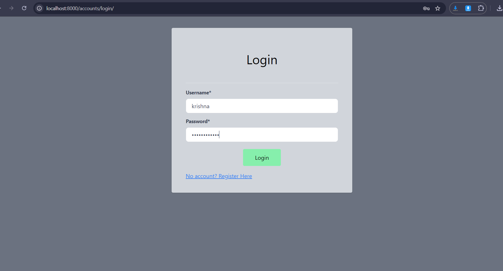
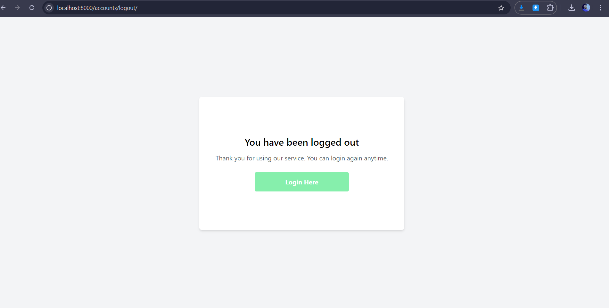
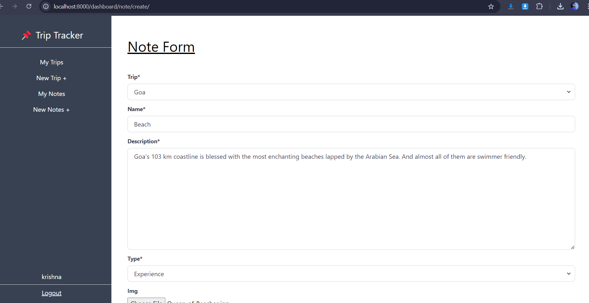
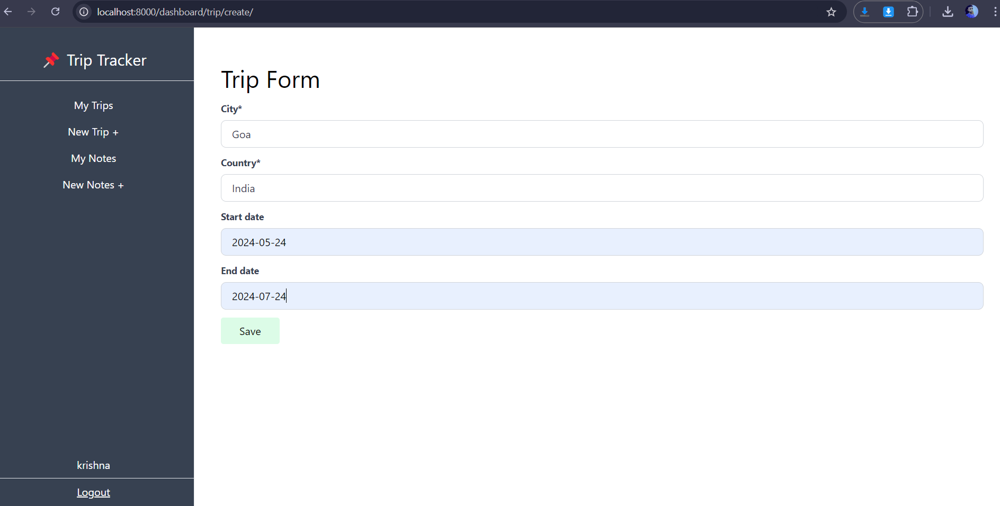
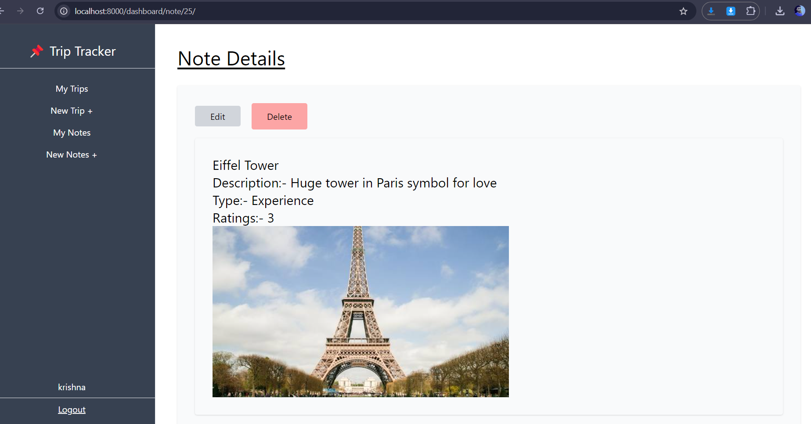
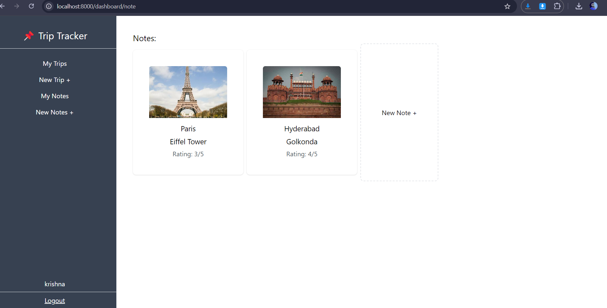
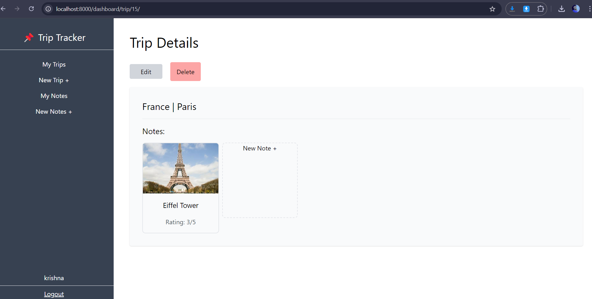

To include the screenshots in your `README.md` file, you can use Markdown image syntax. Below is the modified `README.md` with screenshots linked based on the file paths provided:

---

# Trip Tracker

### A Django-based web application with TailwindCSS for tracking and managing trips.

## Table of Contents
- [Project Overview](#project-overview)
- [Features](#features)
- [Tech Stack](#tech-stack)
- [Installation](#installation)
- [Usage](#usage)
- [Screenshots](#screenshots)
- [Contributing](#contributing)
- [License](#license)
- [Contact](#contact)

---

## Project Overview

Trip Tracker is a Django web application designed to help users track trips, manage expenses, and keep track of their journey details. With a modern interface powered by TailwindCSS, users can create, update, and manage their trips efficiently.

## Features
- **Create and Track Trips**: Easily add new trips with start/end dates, locations, and activities.
- **Expense Management**: Keep track of expenses for each trip and monitor budgets.
- **Dashboard View**: View upcoming and completed trips with summary insights.
- **Responsive Design**: Built using TailwindCSS for a seamless experience across devices.
- **Edit and Delete Trips**: Modify trip details or remove trips when needed.

## Tech Stack
- **Frontend**: HTML, TailwindCSS, JavaScript
- **Backend**: Django (Python framework)
- **Database**: SQLite (default), or any other Django-supported database like PostgreSQL or MySQL
- **Version Control**: Git

## Installation

To run this project locally, follow these steps:

### Prerequisites
- Python 3.x
- Django
- Node.js (for TailwindCSS)
- Pip package manager
- Git

### Steps
1. Clone the repository:
    ```bash
    git clone https://github.com/username/trip-tracker.git
    cd trip-tracker
    ```

2. Set up a virtual environment:
    ```bash
    python -m venv env
    source env/bin/activate  # On Windows use `env\Scripts\activate`
    ```

3. Install dependencies:
    ```bash
    pip install -r requirements.txt
    ```


5. Run Django migrations:
    ```bash
    python manage.py migrate
    ```

6. Run the application:
    ```bash
    python manage.py runserver
    ```

7. Open the app in your browser at:
    ```bash
    http://localhost:8000
    ```

## Usage

- **Create a new trip**: Input trip details such as location, dates, and budget.
- **Track expenses**: Log travel expenses to monitor trip costs.
- **Manage trips**: Edit or delete trip details at any time from the dashboard.

## Screenshots

Here are some screenshots to showcase the app:

- **Home Screen**  
  

- **Alternative Home Screen**  
  

- **Index Page**  
  

- **Login Page**  
  

- **Logout Page**  
  

- **New Note Page**  
  

- **New Trip Page**  
  

- **Note Details Page**  
  

- **Notes List**  
  

- **Trip Details Page**  
  

## Contributing

Contributions are welcome! To contribute:
1. Fork the repository.
2. Create a new branch (`git checkout -b feature/your-feature`).
3. Commit your changes (`git commit -m 'Add feature'`).
4. Push to the branch (`git push origin feature/your-feature`).
5. Open a Pull Request.

## License

This project is licensed under the MIT License. See the [LICENSE](LICENSE) file for details.

## Contact

For any questions or suggestions, feel free to reach out:

- **Akshat Raj** - akshatraj2607@gmail.com
- [GitHub Profile](https://github.com/akshatraj26)

---

This `README.md` now includes links to all the screenshots in your `screenshots` folder. Make sure the folder and images are correctly uploaded to your GitHub repository.